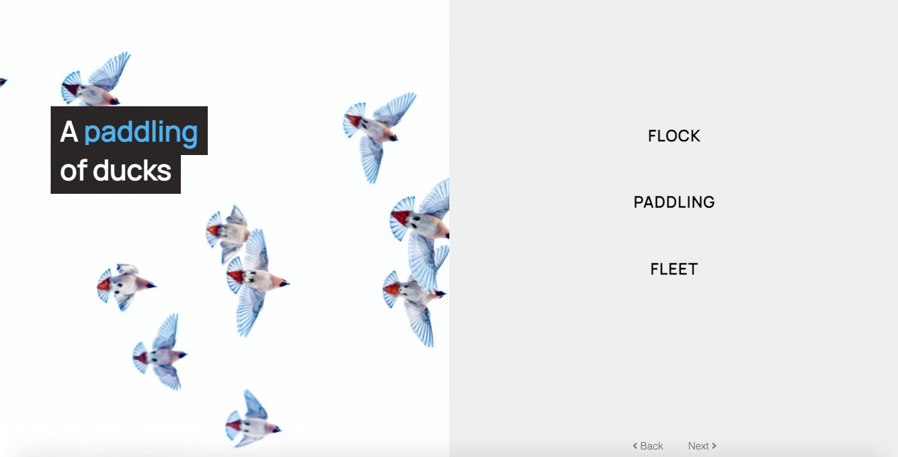

# What the flock

A quiz for the weird and wonderful English nouns for flocks of birds.



This is the first personal project I ever made, created one weekend during my coding bootcamp in 2018. I update it every now and then when I find a new technology and so it's become a living document of things I've learned and liked: react hooks, typescript, lambda functions, docker, golang...

## Requirements

* [docker](https://www.docker.com/products/docker-desktop)
* docker-compose
* [netlify dev](https://www.netlify.com/products/dev/)


## Develop

To develop locally, run:
```
make dev
```

This starts a dockerised mongodb, seeded with a small set of quiz questions, and runs the app using `netlify dev`.

To clean up, run:
```
make clean
```